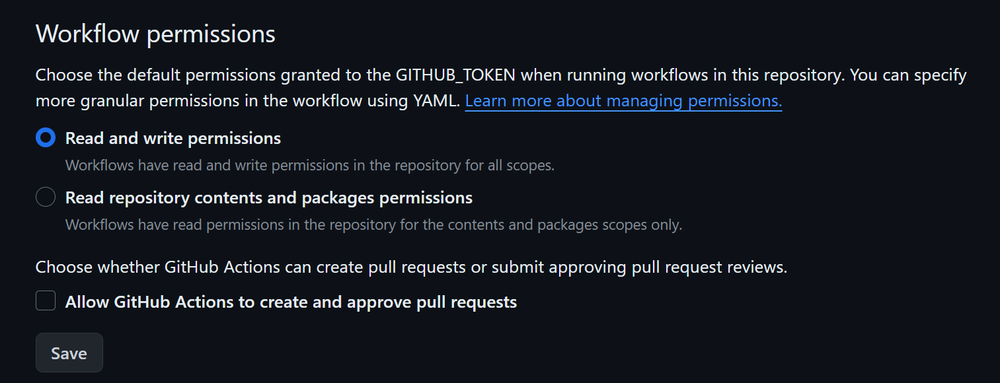

# Electron-Svelte template

<p align="center">
  <a href="https://github.com/planetsLightningArrester/electron-svelte-template/blob/main/README.zh-cn.md"><b>简体中文</b></a> |
  <a href="https://github.com/planetsLightningArrester/electron-svelte-template/blob/main/README.en-us.md"><b>English</b></a> |
  <a href="https://github.com/planetsLightningArrester/electron-svelte-template/blob/main/README.es-mx.md"><b>Español</b></a> |
  <a href="https://github.com/planetsLightningArrester/electron-svelte-template/blob/main/README.md"><b>Português</b></a>
</p>

<h2 align="center">Portable desktop template app for Windows, Linux, and MacOS using <a href="https://www.electronjs.org/"><b>Electron.js</b></a> and <a href="https://svelte.dev/"><b>Svelte</b></a></h2>

# Content

- [Electron-Svelte template](#electron-svelte-template)
- [Content](#content)
  - [💯 Use cases](#-use-cases)
  - [✨ Features](#-features)
  - [🚩 Considerations](#-considerations)
  - [🚀 Usage](#-usage)
  - [🐛 Possible Issues](#-possible-issues)
  - [💻 Development](#-development)
    - [⚙️ Setup](#️-setup)
    - [🧪 Tests](#-tests)
  - [🫡 Thank You? You're Welcome](#-thank-you-youre-welcome)
  - [📜 License](#-license)

## 💯 Use cases
- [Leitor de notas de corretagem](https://github.com/planetsLightningArrester/leitor-de-notas-de-corretagem)

## ✨ Features

Template repository for creating apps using Electron.js as the backend and Svelte as the frontend.

- Frontend - `frontend/package.json`
  - [Svelte](https://svelte.dev/) as the framework
  - [Vite](https://vitejs.dev/) as the bundler
  - [i18n](https://github.com/kaisermann/svelte-i18n) for frontend multilingual applications
  - [svelte-check](https://www.npmjs.com/package/svelte-check) as the vulnerability checker
  - Prettier
  - Eslint
  - Typescript
- Backend - `backend/package.json`
  - [Electron](https://www.electronjs.org/) as the framework
  - [Electron forge](https://www.electronforge.io/) as the packager
  - [Playwright](https://playwright.dev/) as the tester engine
  - [Electronegativity](https://github.com/doyensec/electronegativity) as the vulnerability checker
  - [Nodemon](https://nodemon.io/) for watch-mode development
  - Native auto-update based on GitHub Releases (doesn't require software signature)
  - Prettier
  - Eslint
  - Typescript
- Infrastructure - `./package.json`
  - [Husky](https://github.com/typicode/husky) enabled with:
    - Commit messages as per [@commitlint/config-conventional](https://github.com/conventional-changelog/commitlint/tree/master/%40commitlint/config-conventional)
    - Auto-lint before `git commit`
    - Lint, test, and build before `git push`
    - `npm ci` for the root `package.json`, backend, and frontend after running `git pull`
  - VS Code
    - `.vscode/launch.json` and `.vscode/tasks` with VS Code ready for debugging
    - Recommended extensions
  - GitHub
    - Pull request template
    - Issue template for bug report and feature request
    - Workflow for Continuous Integration running tests on `push`
    - Workflow to auto-update dependencies to latest running daily (if passes CI, bumps [patch version](https://semver.org/))
    - Workflow to create releases on auto-update. Also create a release with `git tag` if following the [semantic versioning](https://semver.org/).
      - Ex: `git tag v2.11.553 && git push -u origin main --tags`

## 🚩 Considerations
- There are only end-to-end tests (e2e) `backend/src/__tests__/e2e`. There's no frontend-only or backend-only test
- The build result is a `.zip` file with a portable executable. The portable is always generated for the current OS running
- No installer is generated because to use installers require [paying for signing keys](https://www.electronjs.org/docs/latest/tutorial/code-signing)

## 🚀 Usage

**Issue the commands from the root directory**

```bash
# Install all deps in root, backend, and frontend. Also, install husky git hooks
npm ci
# Run all tests (only e2e tests are available)
npm run test
# Start frontend and backend and launch the application with hot-reload enabled
npm run start
# Generate a zip with a portable
npm run build
# To make a release, bump `version` inside `backend/package.json`. The other `package.json` have no `version` field
cd backend && npm version patch
```

## 🐛 Possible Issues

- The auto-update workflow update and prod and dev dependencies to their latest and runs a CI. If everything passes, it will create a new release. If one choses to use this, make sure one has a good test coverage to prevent degradations to be released.
- If you encounter any issue, consider reporting an [Issue](https://github.com/planetsLightningArrester/electron-svelte-template/issues)
- Error messages can be found at:
  - Linux: `~/.config/electron-svelte-template-backend/log`
  - Mac: `~/Library/Application Support/electron-svelte-template-backend/log`
  - Windows: `%APPDATA%/electron-svelte-template-backend/log`
- Check the checkbox below to prevent the GitHub auto-update workflow from failing due to lack of write permission - **Settings > Actions > General**.


## 💻 Development

Requires Node `>=18`.

### ⚙️ Setup

To run on WSL, some packages need to be installed:

```bash
sudo apt install libgconf-2-4 libatk1.0-0 libatk-bridge2.0-0 libgdk-pixbuf2.0-0 libgtk-3-0 libgbm-dev libnss3-dev libxss-dev libasound2 zip
```

To reduce noise due to `dbus` on WSL:

```bash
source scripts/dbus.sh
```

The scripts `scripts/force_update*` are used in the `.github/workflows/auto_update.yml` to force `npm` update all prod and dev dependencies to their latest to validate.

### 🧪 Tests

```bash
npm ci
npm run test
```

## 🫡 Thank You? You're Welcome

If I helped you, send a "Thanks!" 👋 through [pix](https://www.bcb.gov.br/en/financialstability/pix_en) 😊
> a09e5878-2355-45f7-9f36-6df4ccf383cf

## 📜 License

According to the license, this software provides no warranty, and the author disclaims any responsibility for use. Use at your own responsibility and risk.

[GNU GPLv3](https://choosealicense.com/licenses/gpl-3.0/)