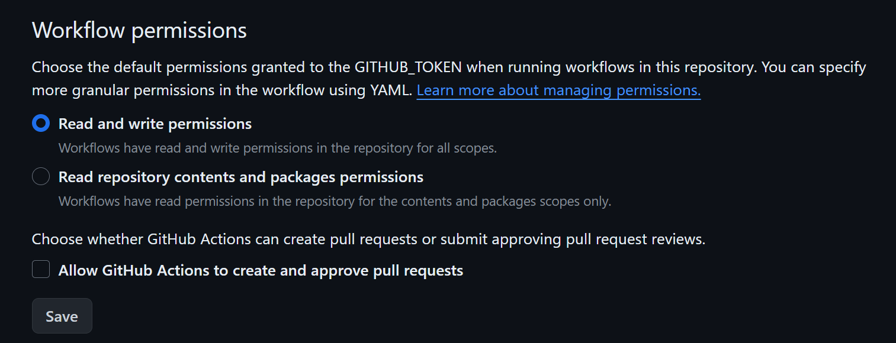

# Electron-Svelte 模板

<p align="center">
  <a href="https://github.com/planetsLightningArrester/electron-svelte-template/blob/main/README.zh-cn.md"><b>简体中文</b></a> |
  <a href="https://github.com/planetsLightningArrester/electron-svelte-template/blob/main/README.en-us.md"><b>English</b></a> |
  <a href="https://github.com/planetsLightningArrester/electron-svelte-template/blob/main/README.es-mx.md"><b>Español</b></a> |
  <a href="https://github.com/planetsLightningArrester/electron-svelte-template/blob/main/README.md"><b>Português</b></a>
</p>

<h2 align="center">适用于 Windows、Linux 和 MacOS 的便携式桌面应用程序模板，使用 <a href="https://www.electronjs.org/"><b>Electron.js</b></a> 和 <a href="https://svelte.dev/"><b>Svelte</b></a></h2>

# 内容

- [Electron-Svelte 模板](#electron-svelte-模板)
- [内容](#内容)
  - [💯 使用案例](#-使用案例)
  - [✨ 特性](#-特性)
  - [🚩 注意事项](#-注意事项)
  - [🚀 使用](#-使用)
  - [🐛 可能出现的问题](#-可能出现的问题)
  - [💻 开发](#-开发)
    - [⚙️ 设置](#️-设置)
    - [🧪 测试](#-测试)
  - [🫡 感谢？不客气](#-感谢不客气)
  - [📜 许可证](#-许可证)

## 💯 使用案例
- [Leitor de notas de corretagem](https://github.com/planetsLightningArrester/leitor-de-notas-de-corretagem)

## ✨ 特性

用 Electron.js 作为后端和 Svelte 作为前端创建应用程序的模板存储库。

- 前端 - `frontend/package.json`
  - [Svelte](https://svelte.dev/) 作为框架
  - [Vite](https://vitejs.dev/) 作为打包工具
  - [i18n](https://github.com/kaisermann/svelte-i18n) 用于前端多语言应用程序
  - [svelte-check](https://www.npmjs.com/package/svelte-check) 作为漏洞检查器
  - Prettier
  - Eslint
  - Typescript
- 后端 - `backend/package.json`
  - [Electron](https://www.electronjs.org/) 作为框架
  - [Electron forge](https://www.electronforge.io/) 作为打包工具
  - [Playwright](https://playwright.dev/) 作为测试引擎
  - [Electronegativity](https://github.com/doyensec/electronegativity) 作为漏洞检查器
  - [Nodemon](https://nodemon.io/) 用于热重载开发
  - 基于 GitHub Releases 的本地自动更新（不需要软件签名）
  - Prettier
  - Eslint
  - Typescript
- 基础设施 - `./package.json`
  - [Husky](https://github.com/typicode/husky) 启用了以下功能：
    - 提交消息符合 [@commitlint/config-conventional](https://github.com/conventional-changelog/commitlint/tree/master/%40commitlint/config-conventional)
    - `git commit` 前自动进行 lint
    - 在 `git push` 前进行 lint、测试和构建
    - 在运行 `git pull` 后为根目录 `package.json`、后端和前端运行 `npm ci`
  - VS Code
    - 包含 `.vscode/launch.json` 和 `.vscode/tasks`，VS Code 已准备好进行调试
    - 推荐的扩展
  - GitHub
    - 拉取请求模板
    - 用于 bug 报告和功能请求的问题模板
    - 连续集成工作流，将测试运行在 `push` 时
    - 自动将依赖项更新到最新版本的工作流，每天运行一次（如果通过 CI，会增加 [补丁版本](https://semver.org/)）
    - 根据自动更新或 `git tag` 推送遵循[语义化版本](https://semver.org/)的工作流创建发布
      - 例如：`git tag v2.11.553 && git push -u origin main --tags`

## 🚩 注意事项
- 只有端到端测试（e2e）`backend/src/__tests__/e2e`。没有仅前端或仅后端测试
- 构建结果是一个带有便携式可执行文件的 `.zip` 文件。便携式版本始终为当前运行的操作系统生成
- 没有生成安装程序，因为使用安装程序需要[支付签名密钥的费用](https://www.electronjs.org/docs/latest/tutorial/code-signing)

## 🚀 使用

**从根目录执行以下命令**

```bash
# 在根目录、后端和前端安装所有依赖项。还安装了 husky git 钩子
npm ci
# 运行所有测试（仅有 e2e 测试可用）
npm run test
# 启动前端和后端，并启动带有热重载的应用程序
npm run start
# 生成一个带有便携式的 zip 文件
npm run build
# 要发布，请在 `backend/package.json` 中递增 `version`。其他 `package.json` 没有 `version` 字段
cd backend && npm version patch
```

## 🐛 可能出现的问题

- 自动更新工作流会将生

产和开发依赖项更新到最新版本并运行 CI。如果一切顺利，它将创建一个新的发布版本。如果选择使用此功能，请确保有良好的测试覆盖率，以防止发布出现退化。
- 如果遇到任何问题，请考虑报告一个 [Issue](https://github.com/planetsLightningArrester/electron-svelte-template/issues)
- 错误消息可以在以下位置找到：
  - Linux：`~/.config/electron-svelte-template/log`
  - Mac：`~/Library/Application Support/electron-svelte-template/log`
  - Windows：`%APPDATA%/electron-svelte-template/log`
- 请勾选下面的复选框，以避免 GitHub 的自动更新工作流程由于缺乏写入权限而失败 - **Settings > Actions > General**


## 💻 开发

需要 Node `>=18`。

### ⚙️ 设置

要在 WSL 上运行，需要安装一些包：

```bash
sudo apt install libgconf-2-4 libatk1.0-0 libatk-bridge2.0-0 libgdk-pixbuf2.0-0 libgtk-3-0 libgbm-dev libnss3-dev libxss-dev libasound2 zip
```

为了减少 WSL 上由于 `dbus` 引起的噪音：

```bash
source scripts/dbus.sh
```

`.github/workflows/auto_update.yml` 中使用 `scripts/force_update*` 脚本来强制更新所有生产和开发依赖项至最新版本以进行验证。

### 🧪 测试

```bash
npm ci
npm run test
```

## 🫡 感谢？不客气

如果我帮到了你，请通过 [pix](https://www.bcb.gov.br/en/financialstability/pix_en) 发送一个 "谢谢！" 👋 😊
> a09e5878-2355-45f7-9f36-6df4ccf383cf

## 📜 许可证

根据许可证，本软件不提供任何保证，作者不对使用负任何责任。请自行承担责任和风险使用。

[GNU GPLv3](https://choosealicense.com/licenses/gpl-3.0/)